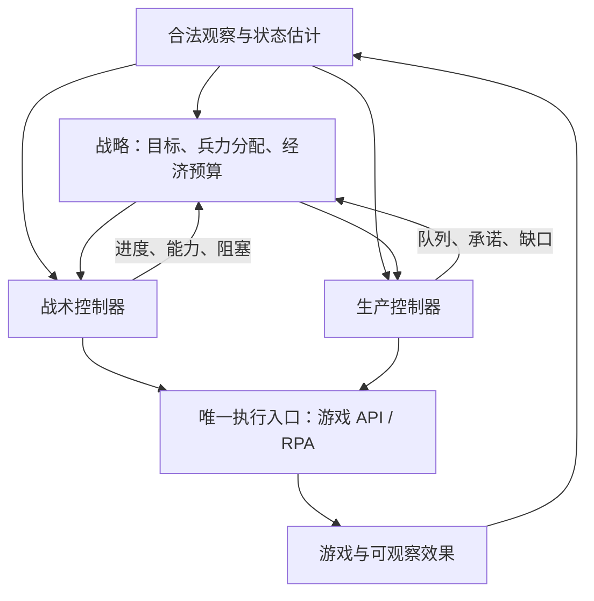

# 战略、战术与执行分层推演

状态：2026-09-16，针对用户提出的职责分离、未来高层 AI / 末端 RPA、人类经验分别落地的设计推演。当前已发布实现仍为 0.1.5；本设计尚未实施，也没有分层后的棋力或性能实测结果。

## 1. 判断及现状

建议进行一次有明确边界的小范围分离。当前已有适合复用的基础：

- [policy.ts](../src/policy.ts) 的 Commander 只接收普通观察数据，不持有引擎句柄。
- [bridge.ts](../src/bridge.ts) 负责合法观察和唯一的动作提交入口；会拒绝过期观察、当前不可用的己方对象、不可见的对象目标、同批单位或队列冲突。
- [effects.ts](../src/effects.ts) 区分请求与实际可观察效果，移动只标为位置改变，不等于到达。
- RaidTask / RegroupTask 已有局部任务记忆，但仍直接产生逐单位意图；Intent.task 主要是记录标签，没有完整的任务约束、持续控制权及反馈协议。

战略与战术仍混在 Commander.decide 中：经济投向、开局阶段、全军目标、逐单位目标选择、碾压和指令节流都在同一流程。当前运行时是本地同步规则代码，每 3 tick 决策；没有大模型逐帧操作单位。分层的即时价值是降低改动牵连、便于归因和吸收经验；以后可在高层接入其他决策器。

现有策略持续读取新观察，已经形成反馈循环；单条意图的效果分类目前主要写入日志，尚未形成任务级的进展与阻塞反馈。

已有 [接口契约](interface-contract.md) 已提出 Task、Intent、唯一提交点、预算承诺与效果反馈。本设计落实这些概念的职责划分，复用现有工程，不另建任务平台。

## 2. 为什么此时值得做

| 已观察的问题 | 分层要解决的具体混淆 | 不能由分层自动保证的事 |
| --- | --- | --- |
| 0.1.5 对 counter 的城镇败局，四车出厂后仍前后脱节，先到部队被逐批击毁 | 战略上的出击承诺与战术上的实际共同接敌能力分开记录 | 新的队形控制一定能赢 |
| formed 在打完局部目标后返回基地，等待严格靠拢，丢掉后续进攻时机 | 战术准备条件不能悄悄重写战略目标或无限延长准备 | 严格队形一定优于灵活接战 |
| 曾凑齐四辆，但出厂期间损失一辆后又等到时间上限 | 战略生产阶段的完成状态与当前战术可用兵力分开 | 伤亡后始终继续进攻都是正确选择 |
| 在建矿场与矿车队列同时投入，出现第五辆矿车及补兵空档 | 战略的经济预算与生产控制器的队列、附带单位账本分开 | 少造一辆矿车就一定提高整局胜率 |

证据见 [集结迭代记录](assembly-cycle.md)。当前主线的行军案例为 `runs/muster-pool/mp03t4.map/counter/1-muster`：回放核对了 230 份原快照和终局；后两车的首次冷却重启信号明显落后，己方首批四车损失时对方首批四车仍存活。冷却信号用于定位射击时段，不当作精确命中或胜因证明。

## 3. 目标架构：三层控制，共用合法状态

| 职责 | 决定什么 | 输出什么 |
| --- | --- | --- |
| 战略层 | 是否进攻、整队撤退、骚扰或回防；保护哪个区域；投入与保留哪些部队；经济和军力的预算、优先级 | 持续任务及其约束、经济计划 |
| 战术控制器 | 在分配兵力和任务范围内选择接近方式、局部队形、集火、碾压、短暂避险和增援汇合 | 单位级意图，任务进展及能力不足报告 |
| 生产控制器 | 把经济计划落实到可用建筑、生产队列、建造先后及附带单位账本 | 生产/放置意图，预算占用及阻塞报告 |
| 执行层 | 调用 API，或完成选择、镜头、热键、鼠标操作；处理有效性、节流及效果核验 | 已提交、已观察到何种效果、仍未确认或失败 |

生产控制器与战术控制器属于同一层级的任务控制器，不让作战微操顺便决定扩矿。开局可以先保留一个全军任务及一个生产计划；具体小队划分按真实需求增加。

各层都可先复用规则代码。战略将来可替换为规则、搜索或模型；战术也可以独立采用更好的规则或学习模块。分层不以引入大模型为前提。

## 4. 层与层之间传递任务，而非一串长期点击

最少保留以下任务内容，按已有 Task / Intent 契约实现：

- 任务 ID、修订号及所属对局。
- 目标或目标区域、分配的单位/小队、优先级。
- 可用资源承诺，以及明确保留给其他任务的资源。
- 允许的局部行为与风险：可追击范围、可等待范围、局部避险和中止权限。
- 可验证的完成条件、退出条件和失效条件。

任务修订号保持稳定，直到目标、兵力或约束真正改变；每次战略检查不自动生成新任务，以免反复重置战术状态。

### 一个具体例子（假设，不是已实现行为）

假设已有六辆坦克，战略选择：四辆沿已侦察方向推进，另两辆守住矿区；保留补兵预算，暂缓第二矿场。

战术控制器负责四辆如何通过狭窄区域、先打哪个当前可见目标、是否短暂回撤等后车。它不能借走守矿的两辆，也不能为了保持队形自行把全军带回基地。若无法按任务限制共同接敌，报告落后单位、可见威胁和进展阻塞，由战略选择继续等待、缩小目标或中止进攻。

生产控制器依据现有队列、已提交生产、已观察新单位及已核实的矿场附带单位，落实补兵预算。预留金额只是规划承诺，不改写真实 credits；提交一次生产也不能当成全部花费已扣或战力已到场。

### 撤退的两种权限

- 全军放弃一次进攻、转去保护另一个矿区、改成骚扰：战略决策。
- 前排短暂退让、残血车脱离火线、等待近处援军：战术行为，但受任务范围约束。
- 紧急情况可执行预先授权的避险或中止，并立即上报，无需等待慢速推理。战略明确允许牺牲或牵制时，战术也不能用统一的保命规则否定任务。

战术报告可行性和代价，战略保留全局取舍权；纯粹不可执行的动作由执行层拒绝。准备不足与操作失败分别报告，避免都变成一个模糊的“任务没完成”。

## 5. 控制权、反馈及时间

### 单一控制权

每个单位在一个时刻只属于一个任务，同一生产队列由一个控制器负责；任务优先级和转交在唯一提交点之前确定。现有 bridge 的同批冲突检查继续保留。

任务转交要撤销旧任务尚未提交的意图，并处理已经在游戏中执行的旧命令。停止继续发令不等于停止已有 AttackMove。晚到的计算结果要检查对局、任务修订、控制权与有效条件，不能由异步回调自行调用游戏。

### 反馈内容

执行层报告“已发送”“出现队列项”“单位位置改变”等事实；战术或生产控制器据此维护任务进度。任务完成只使用符合观察协议的证据：敌人离开视野不等于已被摧毁，位置变动不等于到达或形成队形。

战略应知道战术能力不足或执行通道拥堵，以便调整任务。代码可以独立替换，能力与预算信息仍必须双向流动。

反馈先报告少量可核验的事实，并单独标记估计及未知状态。准备条件和字段含义要明确，避免把“观察到四辆”“四辆已出厂”“四辆能共同接敌”都压成同一个 ready。当前不可用的己方对象也不直接记为已死亡。

### 更新频率

第一次抽取职责时保持现有 3 tick 调度和命令节奏，避免把频率变化混入重构。职责拆开并核验后，再比较战略低频/事件触发、战术快速反馈的运行方式；节约推理或 CPU 的结论需要实测。

以后接入异步战略推理时，长效任务按期限和前提重新检查；即时单位意图仍须依据当前有效观察。现有同步提交要求 tick 相同，不能直接拿来假装已经支持慢速实时推理。异步运行需要单独的延迟协议，记录观察年龄、规划延迟、失效任务和实际提交时间；暂停离线引擎等待推理的速度不当作实时能力。

## 6. 对 RPA 路线的实际帮助与前提

若高层使用大模型，它只需要给出任务和预算；本地战术/生产控制器持续反馈执行，RPA 完成末端操作。模型不需要每帧指定每辆坦克的屏幕坐标。

当前图形版中的 bot 仍通过游戏 API 下令；人工席位的浏览器操作验收不等于 bot 已采用 RPA。迁移时分别验证：

1. **观察适配。** API 的单位引用、准确坐标、血量、生产队列并不自然等于画面可稳定获取的信息。RPA 需要状态跟踪、观测时间与未知状态，不能用隐藏 API 真值填补视觉缺口。
2. **操作能力。** 单一镜头和选择状态需要串行仲裁，保持“选择编队→发出命令”的连续性；验证偏移、延迟、部分执行及吞吐。生产请求不能因超时盲目重复。
3. **条件记录。** API 观察加 RPA 操作的过渡实验应明确标为混合条件。纯 RPA 的观察/操作协议变化后，基线和候选都重新评测。与真人同时对战的客户端及输入控制方式另行验证，不能默认一个窗口可以独立控制双方。

优先复用现有原生寻路、攻击移动和成熟的输入自动化能力；独立验证新增编队控制。单次群体命令是否能维持共同到场，不作为既有能力假设。

所有层都只使用合法观察及由其形成的历史判断。现有密集回放分析中的对手私有状态、原生 ID 和全图事件继续留在裁判/分析侧。若需要新的射程、冷却或可达性字段，应按观察协议先核验，再考虑接入控制器。

任务能力和预算取自明确声明的本方执行条件，不把对手计算耗时、模式或隐藏工作量传给战略层。

## 7. 怎样独立评价，又保留对相互影响的检查

固定战略代码与配置，保留它根据变化后的局面作出反应的能力。战术改善存活率后，同一战略可能更早达到扩矿条件；这种轨迹变化属于组合效果，不能靠拆文件消除。

下表是拟议实验，不是已运行结果。观察、生产控制、执行通道、对手和评分规则在比较中固定。

| 组合 | T0 当前战术 | T1 候选战术 |
| --- | --- | --- |
| S0 当前战略 | 基准 | 在现有战略下测战术变化 |
| S1 候选战略 | 在现有战术下测战略变化 | 检查组合及相互影响 |

只改战术时先比较 S0T0 / S0T1；两层都改过或怀疑交互时，再补必要的交叉组合，不要求每轮铺满大矩阵。模块和配置记入现有 manifest，实际参赛的完整包仍独立冻结。改生产控制、观察或执行协议时另立比较，不混进某个战略/战术得分。

- 新战术让局部损失下降，但等待更久、全局胜率更低：查任务时间和机会成本，不按局部交换比晋升。
- 战术对 S0 有用，对 S1 无用：查新战略是否提出了另一类兵力/时机要求，确认适用条件或保留不同组合。
- 看似坏战略在更可靠执行器上成功：此前的执行能力限制可能影响了判断；不能将两种执行条件直接相减。

验证分两步：先做行为保持的重构，再做策略改动。可在真实运行的每个完整决策观察上，同时运行原冻结 0.1.5 与新组织形式的纯决策代码，仅由原控制器提交，比较语义意图、仲裁和提交结果。两份控制器记忆独立且均不额外读取引擎。现有 150 tick 日志不是完整的 3 tick 决策历史，不能只回灌稀疏日志就声称整局行为等价。

这种影子比较只证明被覆盖轨迹上的一致性。随后还要让新组织形式独立完成真实对局与玩家链路。没有假设 seeded reset、任意状态分叉或 replay takeover；完整胜负、异常和停止规则沿用现有协议。

## 8. 人类经验如何落地

| 用户的经验 | 优先转成哪类假设 | 具体检验 |
| --- | --- | --- |
| “别让坦克一辆一辆送” | 战术的到场/接敌协同；同时检查战略分配是否本来就不足 | 固定战略，比较实际参与射击的时序、等待代价和完整局结果 |
| “对方守得很密，换个方向打经济” | 战略的目标和兵力分配；战术报告接近路线与执行能力 | 骚扰是否真正产生压力、正面是否因此失守，而不是只数骚扰命令 |
| “先补兵，别急着扩矿” | 战略的预算优先级；生产控制器负责正确记账 | 补兵空档、经济代价和完整胜负 |
| “先集火残血坦克” | 战术目标选择，明确适用范围 | 击毁时间、浪费火力、因追击而损失阵位的情况 |

Agent 负责把普通经验转成适用条件、动作、例外和证据来源，用户不必判断应该修改哪个文件或设置多少阈值。经验先作为可检验假设；只改对应模块和必要约束，观察相反案例后再决定是否成为默认规则。

## 9. 建议的最小实施顺序

1. 以已发布 0.1.5 为参照，先抽出战略、作战战术和生产控制职责；保留现有观察、提交桥、效果核验和调度。任务约束先表达原有行为，不在抽取时增强区域限制或改变接战规则。先只迁移当前主线，不要求把所有历史 mode 都重新实现。
2. 用当前城镇 counter 败局、出厂期间伤亡及生产队列案例检查边界，完成影子比较和独立真实运行。重构本身不宣称棋力进步。
3. 固定战略，只针对“出厂后仍逐批接敌”验证一个战术改动；经济账本修正作为独立改动。按结果决定是否需要更复杂的任务结构。
4. 在这些职责和反馈实际有用后，再独立试验较慢的战略决策器或一个 RPA 操作闭环，测量延迟、实际操作与效果。现有 API 路径继续作为可运行参照。

这三层先处于同一进程，使用普通数据接口和已有日志。暂时足够的任务状态和控制权规则优先于通用调度框架。分层的验收是能独立替换一个部件、解释失败来源并保持完整对局/玩家链路；棋力与性能分别由对应实验判断。
